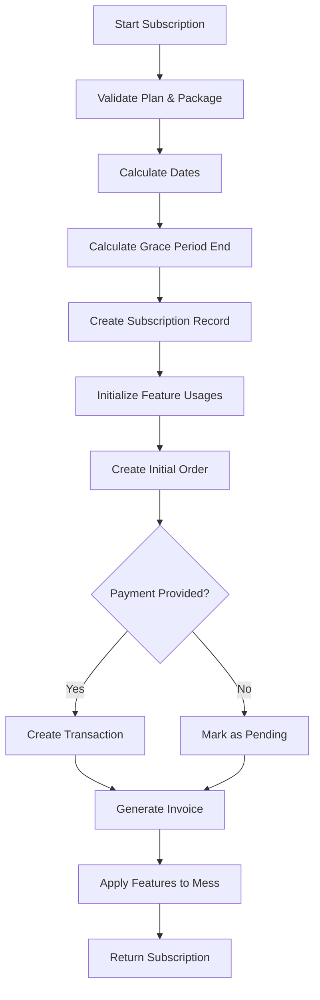
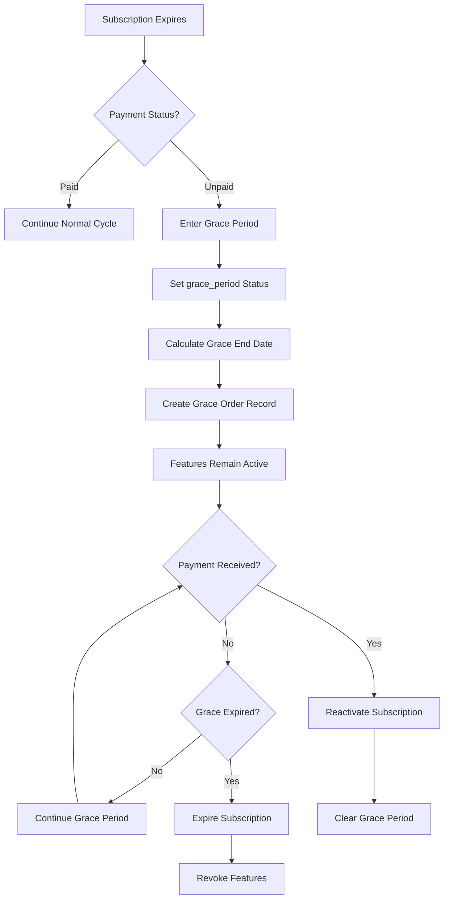
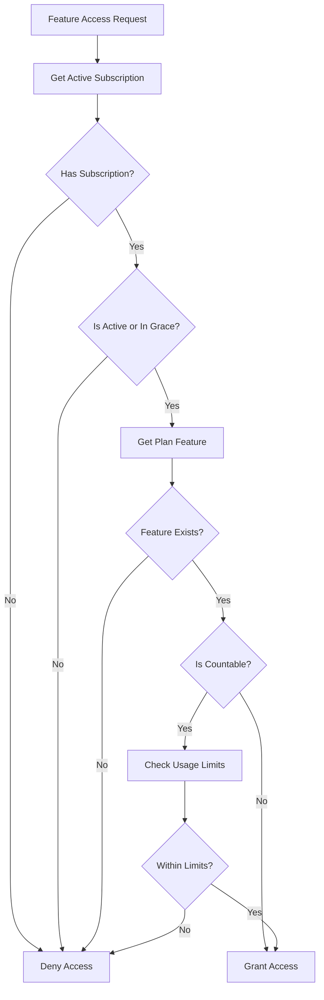

# Laravel Dining Subscription System - Comprehensive Documentation

## Overview
This Laravel application implements a sophisticated subscription management system for dining/mess management platforms. The system provides multi-tier subscription plans with granular feature-based access control, comprehensive billing and invoicing, payment processing integration, and advanced grace period management for improved customer retention.

## System Architecture

### Core Components
The subscription ecosystem consists of interconnected modules:

1. **Plan Management**: Hierarchical plan structure with packages and features
2. **Subscription Lifecycle**: Complete subscription state management
3. **Billing Engine**: Automated billing, invoicing, and payment processing
4. **Grace Period System**: Flexible grace period management for payment recovery
5. **Feature Access Control**: Granular feature usage tracking and limits
6. **Audit Trail**: Comprehensive tracking of all subscription activities

### Database Schema Architecture
```
┌─────────────┐    ┌──────────────────┐    ┌─────────────────┐
│    plans    │───▶│  plan_packages   │    │ plan_features   │
│             │    │                  │    │                 │
│ - keyword   │    │ - duration       │    │ - name          │
│ - name      │    │ - price          │    │ - is_countable  │
│ - is_free   │    │ - grace_period   │    │ - usage_limit   │
└─────────────┘    └──────────────────┘    └─────────────────┘
       │                     │                       │
       └─────────────────────┼───────────────────────┘
                             ▼
                    ┌─────────────────┐
                    │  subscriptions  │
                    │                 │
                    │ - status        │
                    │ - expires_at    │
                    │ - grace_ends_at │
                    └─────────────────┘
                             │
            ┌────────────────┼────────────────┐
            ▼                ▼                ▼
   ┌─────────────────┐ ┌─────────────┐ ┌─────────────┐
   │     orders      │ │transactions │ │  invoices   │
   │                 │ │             │ │             │
   │ - order_number  │ │ - tx_ref    │ │ - inv_number│
   │ - amount        │ │ - status    │ │ - due_date  │
   └─────────────────┘ └─────────────┘ └─────────────┘
```

## Database Tables - Detailed Specifications

### 1. Plans Table (`plans`)
**Purpose**: Define subscription tiers and plan categories

| Field | Type | Constraints | Description |
|-------|------|-------------|-------------|
| `id` | bigint | PRIMARY KEY, AUTO_INCREMENT | Unique plan identifier |
| `keyword` | varchar(255) | UNIQUE, NOT NULL | Plan identifier (basic, premium, enterprise) |
| `name` | varchar(255) | NOT NULL | Human-readable plan name |
| `is_free` | boolean | DEFAULT false | Indicates if plan is free tier |
| `is_active` | boolean | DEFAULT true | Plan availability status |
| `created_at` | timestamp | | Plan creation timestamp |
| `updated_at` | timestamp | | Plan modification timestamp |

**Predefined Plans**:
- **Basic Plan**: Free tier with limited features
- **Premium Plan**: Mid-tier with enhanced capabilities
- **Enterprise Plan**: Full-featured tier with maximum limits

### 2. Plan Packages Table (`plan_packages`)
**Purpose**: Define pricing and duration options for each plan

| Field | Type | Constraints | Description |
|-------|------|-------------|-------------|
| `id` | bigint | PRIMARY KEY, AUTO_INCREMENT | Package identifier |
| `plan_id` | bigint | FOREIGN KEY → plans.id | Parent plan reference |
| `is_trial` | boolean | DEFAULT false | Trial package indicator |
| `is_free` | boolean | DEFAULT false | Free package indicator |
| `duration` | integer | NOT NULL | Package duration in days |
| `price` | decimal(10,2) | DEFAULT 0.00 | Package pricing |
| `default_grace_period_days` | integer | DEFAULT 3 | Default grace period |
| `is_active` | boolean | DEFAULT true | Package availability |
| `created_at` | timestamp | | Creation timestamp |
| `updated_at` | timestamp | | Modification timestamp |

**Standard Package Durations**:
- **Trial**: 3 days (free trial period)
- **6 Months**: 180 days (semi-annual billing)
- **12 Months**: 365 days (annual billing with discount)

**Pricing Structure** (based on PlanSeeder):
```
Basic Plan:
├── Trial (3 days): $0.00
├── 6 Months: $49.99
└── 12 Months: $99.99

Premium Plan:
├── Trial (3 days): $0.00
├── 6 Months: $79.99
└── 12 Months: $149.99

Enterprise Plan:
├── Trial (3 days): $0.00
├── 6 Months: $129.99
└── 12 Months: $199.99
```

### 3. Plan Features Table (`plan_features`)
**Purpose**: Define capabilities and limits for each plan

| Field | Type | Constraints | Description |
|-------|------|-------------|-------------|
| `id` | bigint | PRIMARY KEY, AUTO_INCREMENT | Feature identifier |
| `plan_id` | bigint | FOREIGN KEY → plans.id | Parent plan reference |
| `name` | varchar(255) | NOT NULL | Feature name/identifier |
| `description` | text | NULLABLE | Feature description |
| `is_countable` | boolean | DEFAULT false | Has usage limits |
| `usage_limit` | integer | NULLABLE | Maximum usage count |
| `is_active` | boolean | DEFAULT true | Feature availability |
| `created_at` | timestamp | | Creation timestamp |
| `updated_at` | timestamp | | Modification timestamp |

**Available Features Matrix**:

| Feature | Basic | Premium | Enterprise | Type | Limit |
|---------|-------|---------|------------|------|-------|
| Member Limit | ✓ (10) | ✓ (20) | ✓ (50) | Countable | User count |
| Report Generate | ✓ (5) | ✓ (10) | ✓ (25) | Countable | Monthly reports |
| Meal Add Notification | ✓ | ✓ (5) | ✓ (15) | Boolean/Countable | Notifications |
| Balance Add Notification | ✗ | ✓ | ✓ (10) | Boolean/Countable | Notifications |
| Purchase Notification | ✗ | ✓ | ✓ (15) | Boolean/Countable | Notifications |
| Fund Add | ✗ | ✓ | ✓ | Boolean | Feature toggle |
| Role Management | ✗ | ✗ | ✓ | Boolean | Advanced roles |
| Purchase Request | ✗ | ✗ | ✓ | Boolean | Purchase workflow |

### 4. Subscriptions Table (`subscriptions`)
**Purpose**: Core subscription records with lifecycle management

| Field | Type | Constraints | Description |
|-------|------|-------------|-------------|
| `id` | bigint | PRIMARY KEY, AUTO_INCREMENT | Subscription identifier |
| `mess_id` | bigint | FOREIGN KEY → mess.id, CASCADE | Associated mess |
| `plan_id` | bigint | FOREIGN KEY → plans.id | Current plan |
| `plan_package_id` | bigint | FOREIGN KEY → plan_packages.id | Current package |
| `starts_at` | timestamp | NOT NULL | Subscription start date |
| `expires_at` | timestamp | NOT NULL | Subscription end date |
| `trial_ends_at` | timestamp | NULLABLE | Trial period end |
| `grace_period_ends_at` | timestamp | NULLABLE | Grace period end |
| `admin_grace_period_days` | integer | DEFAULT 0 | Admin-added grace days |
| `status` | varchar(255) | NOT NULL | Current status |
| `payment_method` | varchar(255) | NULLABLE | Payment method used |
| `payment_id` | varchar(255) | NULLABLE | External payment ID |
| `is_canceled` | boolean | DEFAULT false | Cancellation flag |
| `canceled_at` | timestamp | NULLABLE | Cancellation timestamp |
| `last_order_id` | bigint | NULLABLE | Latest order reference |
| `last_transaction_id` | bigint | NULLABLE | Latest transaction reference |
| `payment_status` | varchar(255) | DEFAULT 'pending' | Payment state |
| `billing_cycle` | varchar(255) | DEFAULT 'monthly' | Billing frequency |
| `next_billing_date` | timestamp | NULLABLE | Next payment due |
| `total_spent` | decimal(10,2) | DEFAULT 0.00 | Cumulative spending |
| `invoice_reference` | varchar(255) | NULLABLE | Latest invoice number |
| `created_at` | timestamp | | Creation timestamp |
| `updated_at` | timestamp | | Modification timestamp |

**Subscription Status States**:
- `active`: Subscription is active and paid
- `canceled`: Subscription has been canceled
- `expired`: Subscription has expired without payment
- `trial`: Subscription is in trial period
- `unpaid`: Subscription payment is pending
- `grace_period`: Subscription is in grace period

### 5. Subscription Orders Table (`subscription_orders`)
**Purpose**: Track individual purchase orders and billing events

| Field | Type | Constraints | Description |
|-------|------|-------------|-------------|
| `id` | bigint | PRIMARY KEY, AUTO_INCREMENT | Order identifier |
| `subscription_id` | bigint | FOREIGN KEY → subscriptions.id, CASCADE | Parent subscription |
| `mess_id` | bigint | FOREIGN KEY → mess.id, CASCADE | Associated mess |
| `plan_id` | bigint | FOREIGN KEY → plans.id | Plan at time of order |
| `plan_package_id` | bigint | FOREIGN KEY → plan_packages.id | Package purchased |
| `order_number` | varchar(255) | UNIQUE, NOT NULL | Generated order number |
| `amount` | decimal(10,2) | NOT NULL | Base amount |
| `tax_amount` | decimal(10,2) | DEFAULT 0.00 | Tax portion |
| `discount_amount` | decimal(10,2) | DEFAULT 0.00 | Discount applied |
| `total_amount` | decimal(10,2) | NOT NULL | Final amount |
| `currency` | varchar(255) | DEFAULT 'USD' | Currency code |
| `status` | varchar(255) | NOT NULL | Order status |
| `payment_status` | varchar(255) | NULLABLE | Payment state |
| `billing_address` | text | NULLABLE | Billing address |
| `billing_email` | varchar(255) | NULLABLE | Billing email |
| `notes` | text | NULLABLE | Order notes |
| `metadata` | json | NULLABLE | Additional data |
| `created_at` | timestamp | | Creation timestamp |
| `updated_at` | timestamp | | Modification timestamp |

**Order Number Format**: `ORD-YYYYMMDD-XXXXX`
Example: `ORD-20241215-A1B2C`

### 6. Transactions Table (`transactions`)
**Purpose**: Record payment transactions and payment provider interactions

| Field | Type | Constraints | Description |
|-------|------|-------------|-------------|
| `id` | bigint | PRIMARY KEY, AUTO_INCREMENT | Transaction identifier |
| `subscription_id` | bigint | FOREIGN KEY → subscriptions.id, CASCADE | Parent subscription |
| `mess_id` | bigint | FOREIGN KEY → mess.id, CASCADE | Associated mess |
| `order_id` | bigint | FOREIGN KEY → subscription_orders.id, SET NULL | Associated order |
| `transaction_reference` | varchar(255) | UNIQUE, NOT NULL | Generated reference |
| `payment_method` | varchar(255) | NOT NULL | Payment method |
| `payment_provider` | varchar(255) | NULLABLE | Provider name |
| `payment_provider_reference` | varchar(255) | NULLABLE | Provider transaction ID |
| `amount` | decimal(10,2) | NOT NULL | Transaction amount |
| `currency` | varchar(255) | DEFAULT 'USD' | Currency code |
| `status` | varchar(255) | NOT NULL | Transaction status |
| `notes` | text | NULLABLE | Transaction notes |
| `metadata` | json | NULLABLE | Provider-specific data |
| `processed_at` | timestamp | NULLABLE | Processing timestamp |
| `created_at` | timestamp | | Creation timestamp |
| `updated_at` | timestamp | | Modification timestamp |

**Transaction Reference Format**: `TXN-YYYYMMDD-XXXXXXX`
Example: `TXN-20241215-A1B2C3D`

**Payment Methods Supported**:
- Credit/Debit Cards (Stripe, PayPal)
- Bank Transfers
- Digital Wallets
- Cryptocurrency (future)

### 7. Invoices Table (`invoices`)
**Purpose**: Generate and manage billing invoices

| Field | Type | Constraints | Description |
|-------|------|-------------|-------------|
| `id` | bigint | PRIMARY KEY, AUTO_INCREMENT | Invoice identifier |
| `subscription_id` | bigint | FOREIGN KEY → subscriptions.id, CASCADE | Parent subscription |
| `mess_id` | bigint | FOREIGN KEY → mess.id, CASCADE | Associated mess |
| `order_id` | bigint | FOREIGN KEY → subscription_orders.id, SET NULL | Associated order |
| `transaction_id` | bigint | FOREIGN KEY → transactions.id, SET NULL | Payment transaction |
| `invoice_number` | varchar(255) | UNIQUE, NOT NULL | Generated invoice number |
| `amount` | decimal(10,2) | NOT NULL | Base amount |
| `tax_amount` | decimal(10,2) | DEFAULT 0.00 | Tax portion |
| `discount_amount` | decimal(10,2) | DEFAULT 0.00 | Discount applied |
| `total_amount` | decimal(10,2) | NOT NULL | Final amount |
| `currency` | varchar(255) | DEFAULT 'USD' | Currency code |
| `billing_address` | text | NULLABLE | Billing address |
| `billing_email` | varchar(255) | NULLABLE | Billing email |
| `due_date` | date | NOT NULL | Payment due date |
| `issued_date` | date | NOT NULL | Invoice issue date |
| `paid_date` | date | NULLABLE | Payment completion date |
| `status` | varchar(255) | NOT NULL | Invoice status |
| `notes` | text | NULLABLE | Invoice notes |
| `created_at` | timestamp | | Creation timestamp |
| `updated_at` | timestamp | | Modification timestamp |

**Invoice Number Format**: `INV-YYYYMMDD-XXXXX`
Example: `INV-20241215-00001`

### 8. Feature Usages Table (`feature_usages`)
**Purpose**: Track feature usage against plan limits

| Field | Type | Constraints | Description |
|-------|------|-------------|-------------|
| `id` | bigint | PRIMARY KEY, AUTO_INCREMENT | Usage record identifier |
| `subscription_id` | bigint | FOREIGN KEY → subscriptions.id | Parent subscription |
| `plan_feature_id` | bigint | FOREIGN KEY → plan_features.id | Feature being tracked |
| `used_count` | integer | DEFAULT 0 | Current usage count |
| `reset_at` | timestamp | NULLABLE | When usage resets |
| `created_at` | timestamp | | Creation timestamp |
| `updated_at` | timestamp | | Modification timestamp |

## Grace Period System - Advanced Features

### Multi-Tier Grace Period Architecture
The grace period system implements a sophisticated approach with multiple layers:

#### 1. Package-Level Default Grace Period
```php
// Default grace periods by plan tier
Basic Plan: 3 days
Premium Plan: 3 days  
Enterprise Plan: 3 days (configurable per package)
```

#### 2. Admin-Configurable Extensions
Administrators can extend grace periods through multiple methods:

```php
// Extend existing grace period
$subscriptionService->extendAdminGracePeriod($subscription, 7); // Add 7 days

// Set total admin grace period
$subscriptionService->setAdminGracePeriod($subscription, 14); // Set 14 total admin days

// Calculate total grace period
$totalGraceDays = $subscription->getTotalGracePeriodDays(); 
// Returns: default_grace_period_days + admin_grace_period_days
```

#### 3. Grace Period Lifecycle Management

**Entry Conditions**:
- Subscription has expired (`expires_at <= now()`)
- Payment status is not 'paid'
- Subscription is not canceled
- Grace period hasn't been exhausted

**During Grace Period**:
- All plan features remain accessible
- Payment reminders can be sent
- Service continues uninterrupted
- Admin can extend period if needed

**Recovery Process**:
- Payment received → Immediate reactivation
- Subscription status changes to 'active'
- Grace period cleared
- Normal billing cycle resumes

**Expiration Process**:
- Grace period ends without payment
- Subscription status changes to 'expired'
- All features revoked
- Service access terminated

### Grace Period Audit Trail
Every grace period action is recorded:

```php
// Order records created for:
- Grace period entry
- Admin extensions
- Grace period expiration
- Payment recovery

// Example order notes:
"Subscription entered grace period - payment overdue"
"Admin extended grace period by 7 days"
"Subscription expired after grace period ended"
"Grace period recovery - payment received"
```

## Business Logic Flows - Detailed Implementation

### 1. Subscription Creation Flow


### 2. Grace Period Management Flow


### 3. Feature Access Control Flow


## Advanced Features and Customizations

### 1. Proration Engine
The system includes sophisticated proration calculations:

```php
// Plan change proration example
$daysLeft = $subscription->expires_at->diffInDays(now());
$oldDailyRate = $oldPackage->price / $oldPackage->duration;
$refundAmount = $daysLeft * $oldDailyRate;
$proratedAmount = $newPackage->price - $refundAmount;

// Handle negative proration (credit)
if ($proratedAmount < 0) {
    $proratedAmount = 0; // Or apply as credit
}
```

### 2. Automated Subscription Management
Console command for automated processing:

```php
// Daily scheduled command
php artisan subscriptions:process-grace-periods

// Functions performed:
- Move expired subscriptions to grace period
- Expire subscriptions past grace period
- Send payment reminders
- Update subscription statuses
```

### 3. Payment Provider Integration
Extensible payment provider system:

```php
// Supported providers
'stripe' => [
    'webhook_url' => '/webhooks/stripe',
    'supported_methods' => ['card', 'bank_transfer']
],
'paypal' => [
    'webhook_url' => '/webhooks/paypal', 
    'supported_methods' => ['paypal', 'card']
]

// Metadata storage for provider-specific data
$transaction->metadata = [
    'stripe_charge_id' => 'ch_1234567890',
    'stripe_customer_id' => 'cus_1234567890',
    'payment_intent_id' => 'pi_1234567890'
];
```

### 4. Feature Usage Analytics
Track and analyze feature usage:

```php
// Usage analytics methods
$subscription->getFeatureUsageHistory();
$subscription->getPeakUsagePeriods();
$subscription->getUnusedFeatures();
$subscription->getFeatureEfficiency();

// Reporting capabilities
$mess->generateUsageReport($startDate, $endDate);
$mess->getFeatureAdoptionMetrics();
```

### 5. Billing Cycle Intelligence
Automatic billing cycle detection:

```php
// Based on package duration
duration <= 30 days: 'onetime'
30 < duration <= 180 days: 'monthly' 
duration > 180 days: 'yearly'

// Custom billing logic
$subscription->calculateNextBillingDate();
$subscription->getProrationAmount($newPackage);
$subscription->getBillingHistory();
```

## Security and Compliance

### 1. Data Protection
- Sensitive payment data encrypted at rest
- PCI DSS compliance for payment processing
- GDPR-compliant data handling
- Audit trail for all financial transactions

### 2. Access Controls
- Role-based permissions for admin functions
- Secure API endpoints with authentication
- Rate limiting on payment operations
- Fraud detection mechanisms

### 3. Financial Compliance
- Detailed transaction logging
- Tax calculation readiness
- Multi-currency support framework
- Regulatory reporting capabilities

## Performance Optimizations

### 1. Database Optimizations
```sql
-- Critical indexes for performance
CREATE INDEX idx_subscriptions_status ON subscriptions(status);
CREATE INDEX idx_subscriptions_expires_at ON subscriptions(expires_at);
CREATE INDEX idx_subscriptions_grace_period ON subscriptions(grace_period_ends_at);
CREATE INDEX idx_feature_usages_subscription ON feature_usages(subscription_id);
CREATE INDEX idx_transactions_reference ON transactions(transaction_reference);
```

### 2. Caching Strategy
```php
// Cache frequently accessed data
Cache::remember("subscription_{$messId}", 3600, function() {
    return $mess->activeSubscription;
});

Cache::remember("plan_features_{$planId}", 86400, function() {
    return $plan->features;
});
```

### 3. Queue Processing
```php
// Background processing for heavy operations
ProcessSubscriptionRenewal::dispatch($subscription);
SendPaymentReminder::dispatch($subscription);
GenerateInvoicePDF::dispatch($invoice);
```

## Monitoring and Analytics

### 1. Key Metrics
- Monthly Recurring Revenue (MRR)
- Customer Lifetime Value (CLV)  
- Churn Rate and Grace Period Recovery Rate
- Feature Adoption Rates
- Payment Success Rates

### 2. Alerting System
```php
// Critical alerts
- Payment failures
- Grace period entries
- Subscription expirations
- Feature limit breaches
- System errors
```

### 3. Reporting Dashboard
- Real-time subscription metrics
- Revenue analytics
- Feature usage patterns
- Customer behavior insights
- Financial reporting

This comprehensive documentation provides a complete understanding of the Laravel Dining Subscription System, enabling developers and AI assistants to effectively work with, maintain, and extend the platform's subscription management capabilities.
