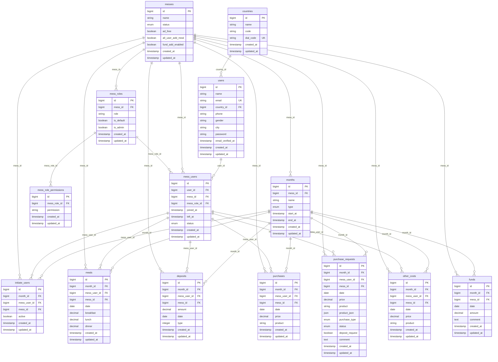
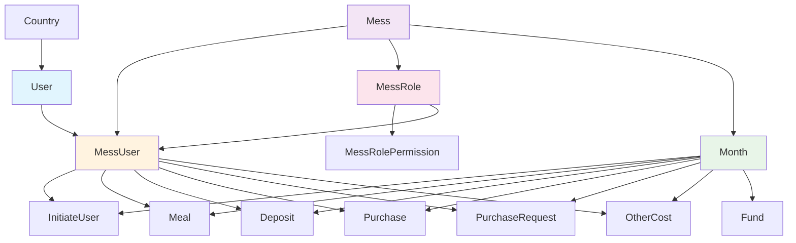
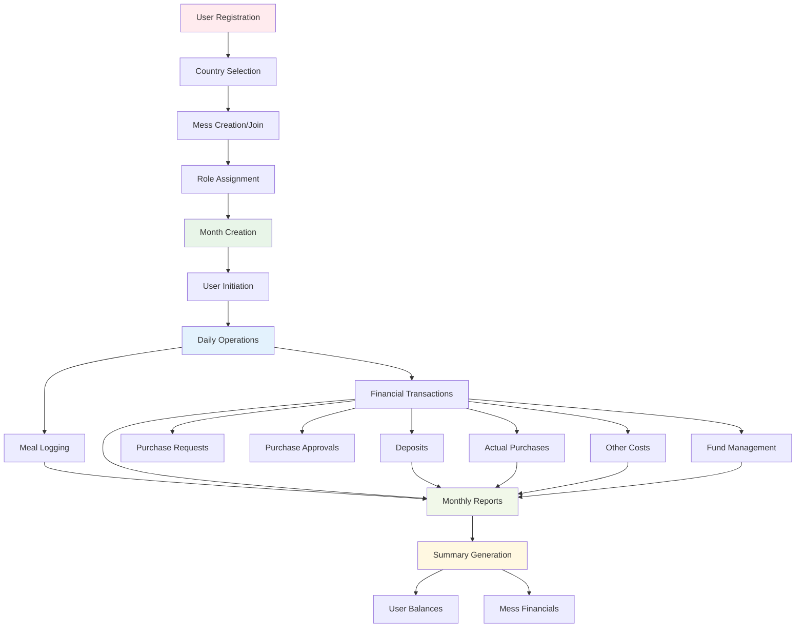
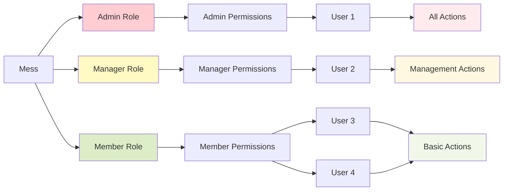

# Database Schema Visualization

## Complete Entity Relationship Diagram

This diagram shows the complete database schema with all relationships and key fields for the My Dining application.



## Simplified Core Architecture

This simplified diagram shows the main entity relationships without all the detailed fields:



## Data Flow Architecture

This diagram shows how data flows through the system during typical operations:



## Permission & Access Control

This shows the role-based access control structure:



## Database Indexes & Performance

Key indexes for optimal performance:

```sql
-- User lookups
CREATE INDEX idx_users_email ON users(email);
CREATE INDEX idx_users_country ON users(country_id);

-- Mess user relationships
CREATE INDEX idx_mess_users_user ON mess_users(user_id);
CREATE INDEX idx_mess_users_mess ON mess_users(mess_id);
CREATE INDEX idx_mess_users_active ON mess_users(mess_id, status, left_at);

-- Month-based queries
CREATE INDEX idx_months_mess_active ON months(mess_id, start_at, end_at);

-- Financial transactions (month-based)
CREATE INDEX idx_meals_month_user ON meals(month_id, mess_user_id);
CREATE INDEX idx_deposits_month_user ON deposits(month_id, mess_user_id);
CREATE INDEX idx_purchases_month_user ON purchases(month_id, mess_user_id);
CREATE INDEX idx_other_costs_month_user ON other_costs(month_id, mess_user_id);

-- Date-based queries
CREATE INDEX idx_meals_date ON meals(date);
CREATE INDEX idx_deposits_date ON deposits(date);
CREATE INDEX idx_purchases_date ON purchases(date);

-- Purchase request workflow
CREATE INDEX idx_purchase_requests_status ON purchase_requests(status);
CREATE INDEX idx_purchase_requests_month_status ON purchase_requests(month_id, status);
```

## Common Query Patterns

### 1. Get User's Current Mess Info
```sql
SELECT u.*, m.name as mess_name, mr.role, mr.is_admin
FROM users u
JOIN mess_users mu ON u.id = mu.user_id
JOIN messes m ON mu.mess_id = m.id
JOIN mess_roles mr ON mu.mess_role_id = mr.id
WHERE u.id = ? AND mu.left_at IS NULL;
```

### 2. Get Month Financial Summary
```sql
-- Deposits
SELECT SUM(amount) as total_deposits FROM deposits WHERE month_id = ?;

-- Purchases  
SELECT SUM(price) as total_purchases FROM purchases WHERE month_id = ?;

-- Other Costs
SELECT SUM(price) as total_other_costs FROM other_costs WHERE month_id = ?;

-- Funds
SELECT SUM(amount) as total_funds FROM funds WHERE month_id = ?;
```

### 3. Get User's Monthly Meal Count
```sql
SELECT 
    SUM(breakfast) as total_breakfast,
    SUM(lunch) as total_lunch,
    SUM(dinner) as total_dinner
FROM meals 
WHERE month_id = ? AND mess_user_id = ?;
```

This database schema supports the complete mess management workflow with proper normalization, referential integrity, and performance optimization.
