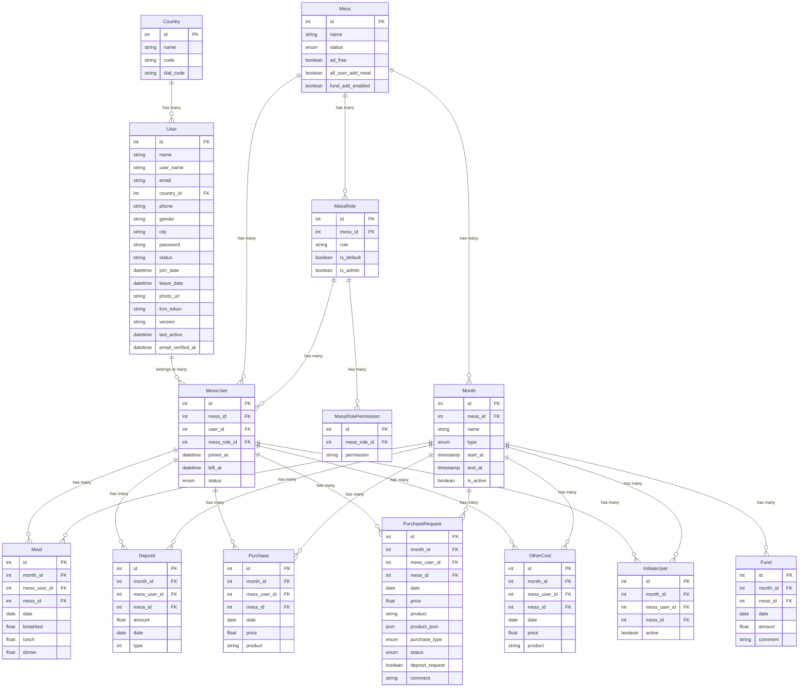
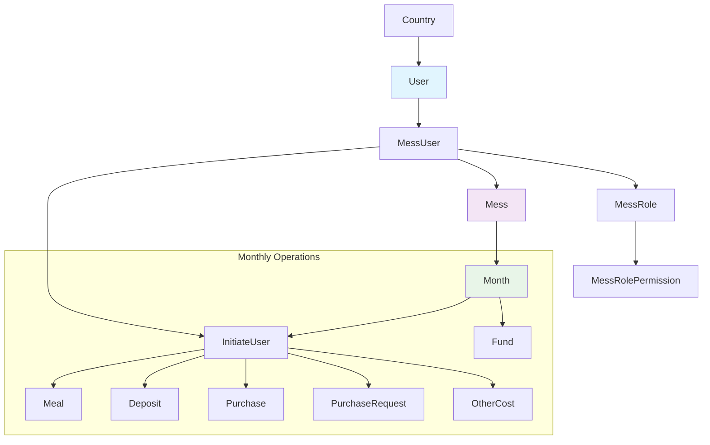

# Model Relationships & Dependencies Documentation

## Overview
This document provides a comprehensive overview of the model relationships and dependencies in the My Dining Laravel application. The system manages mess (dining group) operations including user management, meal tracking, financial transactions, and administrative functions.

## Complete Entity Relationship Diagram



## Core Model Relationships

### 1. User Management Hierarchy

#### User → Country
- **Relationship**: `belongsTo`
- **Purpose**: Links users to their country for phone validation and regional settings
- **Foreign Key**: `country_id`

```php
// User Model
public function country(): BelongsTo
{
    return $this->belongsTo(Country::class);
}
```

#### User → MessUser
- **Relationship**: `hasOne` (current active mess)
- **Purpose**: Links user to their current mess membership
- **Constraints**: Active status, not left mess
- **Foreign Key**: `user_id`

```php
// User Model
public function messUser(): HasOne
{
    return $this->hasOne(MessUser::class, 'user_id', 'id')
        ->with("mess", "role")
        ->whereHas("mess")
        ->whereNull("left_at")
        ->latest()
        ->withDefault(null);
}
```

#### User → Mess (Through MessUser)
- **Relationship**: `hasOneThrough`
- **Purpose**: Direct access to user's active mess
- **Path**: User → MessUser → Mess

```php
// User Model
public function activeMess(): HasOneThrough
{
    return $this->hasOneThrough(
        Mess::class,     // Target model
        MessUser::class, // Intermediate model
        'user_id',       // Foreign key on MessUser
        'id',            // Foreign key on Mess
        'id',            // Local key on User
        'mess_id'        // Local key on MessUser
    )->where("mess_users.status", MessUserStatus::Active->value)
     ->whereNull("left_at")
     ->latest()
     ->withDefault(null);
}
```

### 2. Mess Organization Structure

#### Mess → MessUser
- **Relationship**: `hasMany`
- **Purpose**: All users associated with the mess
- **Foreign Key**: `mess_id`

```php
// Mess Model
public function messUsers(): HasMany
{
    return $this->hasMany(MessUser::class)->with("user", "role.permissions");
}
```

#### Mess → MessRole
- **Relationship**: `hasMany`
- **Purpose**: Role definitions for the mess
- **Foreign Key**: `mess_id`
- **Special Methods**: Specific role accessors (admin, manager, member)

```php
// Mess Model
public function roles(): HasMany
{
    return $this->hasMany(MessRole::class);
}

public function adminRole(): HasOne
{
    return $this->hasOne(MessRole::class)->where('role', MessUserRole::ADMIN);
}
```

#### MessRole → MessRolePermission
- **Relationship**: `hasMany`
- **Purpose**: Permissions assigned to each role
- **Foreign Key**: `mess_role_id`

```php
// MessRole Model
public function permissions(): HasMany
{
    return $this->hasMany(MessRolePermission::class);
}
```

### 3. Monthly Operations Structure

#### Mess → Month
- **Relationship**: `hasMany`
- **Purpose**: All months/periods for mess operations
- **Foreign Key**: `mess_id`
- **Special**: Active month accessor

```php
// Mess Model
public function months(): HasMany
{
    return $this->hasMany(Month::class);
}

public function activeMonth(): HasOne
{
    return $this->hasOne(Month::class)
        ->where(function ($query) {
            $query->whereNull('end_at')
                ->orWhere('end_at', '>=', now());
        });
}
```

#### Month → InitiateUser
- **Relationship**: `hasMany`
- **Purpose**: Users activated for specific months
- **Foreign Key**: `month_id`
- **Note**: Users must be initiated to participate in monthly operations

```php
// Month Model
public function initiatedUser(): HasMany
{
    return $this->hasMany(InitiateUser::class);
}
```

### 4. Financial Transaction Models

All financial models follow the same relationship pattern:

#### Common Relationships for Financial Models
- **Month**: `belongsTo` - Links to specific month/period
- **MessUser**: `belongsTo` - Links to user who made transaction
- **Mess**: Direct foreign key for quick access

#### Deposit Model
```php
public function month(): BelongsTo
{
    return $this->belongsTo(Month::class);
}

public function messUser(): BelongsTo
{
    return $this->belongsTo(MessUser::class);
}
```

#### Purchase Model
- Same pattern as Deposit
- Tracks actual purchases made

#### PurchaseRequest Model
- Same pattern as Deposit/Purchase
- Tracks purchase requests that need approval
- Additional fields: `status`, `purchase_type`, `deposit_request`

#### OtherCost Model
- Same pattern for miscellaneous expenses
- Examples: utilities, maintenance costs

#### Fund Model
- **Unique**: No MessUser relationship (mess-level funds)
- Only relates to Month and Mess directly

### 5. Meal Tracking

#### Meal Model
```php
public function month(): BelongsTo
{
    return $this->belongsTo(Month::class);
}

public function messUser(): BelongsTo
{
    return $this->belongsTo(MessUser::class);
}
```

## Data Flow and Dependencies

### 1. User Onboarding Flow
```
Country → User → MessUser → MessRole → MessRolePermission
```

1. User selects **Country** during registration
2. **User** account is created
3. **MessUser** record links user to mess with role
4. **MessRole** defines permissions
5. **MessRolePermission** grants specific capabilities

### 2. Monthly Operations Flow
```
Mess → Month → InitiateUser → [Meals, Deposits, Purchases, etc.]
```

1. **Mess** admin creates new **Month**
2. Users are added to **InitiateUser** for the month
3. Only initiated users can:
   - Add **Meals**
   - Make **Deposits**
   - Submit **Purchases** and **PurchaseRequests**
   - Record **OtherCosts**

### 3. Permission Flow
```
User → MessUser → MessRole → MessRolePermission
```

1. **User** authentication
2. **MessUser** identifies current mess membership
3. **MessRole** determines user's role in mess
4. **MessRolePermission** grants specific permissions

## Model Dependencies and Constraints

### Hard Dependencies (Cannot exist without parent)
- **MessUser** requires **User** and **Mess**
- **MessRole** requires **Mess**
- **MessRolePermission** requires **MessRole**
- **Month** requires **Mess**
- **InitiateUser** requires **Month**, **MessUser**, and **Mess**
- **Meal** requires **Month** and **MessUser**
- **Deposit** requires **Month** and **MessUser**
- **Purchase** requires **Month** and **MessUser**
- **PurchaseRequest** requires **Month** and **MessUser**
- **OtherCost** requires **Month** and **MessUser**

### Soft Dependencies (Can exist independently)
- **User** can exist without **Country** (nullable foreign key)
- **Fund** only requires **Month** (no specific user)

### Business Logic Dependencies
1. **Users must be initiated** (`InitiateUser`) for a month to participate in operations
2. **Only one active month** per mess at a time
3. **Users can only belong to one active mess** at a time
4. **Role permissions are mess-specific**

## Key Accessor Methods and Computed Properties

### User Model
- `is_email_verified`: Computed from `email_verified_at`
- `activeMess()`: Current mess through MessUser
- `role()`: Current role through MessUser → MessRole

### MessUser Model
- `is_user_left_mess`: Computed from `left_at` field
- `status`: Overridden to show LEFT status if user left

### Month Model
- `is_active`: Computed based on `end_at` and current date

## Usage Patterns

### 1. Check User's Current Mess
```php
$user = auth()->user();
$currentMess = $user->activeMess;
$userRole = $user->role;
$permissions = $user->role?->permissions;
```

### 2. Get Active Month for Mess
```php
$mess = Mess::find($messId);
$activeMonth = $mess->activeMonth;
$initiatedUsers = $activeMonth?->initiatedUser;
```

### 3. Monthly Financial Summary
```php
$month = Month::find($monthId);
$deposits = $month->hasMany(Deposit::class);
$purchases = $month->hasMany(Purchase::class);
$otherCosts = $month->hasMany(OtherCost::class);
$funds = $month->hasMany(Fund::class);
```

### 4. User's Monthly Activity
```php
$messUser = MessUser::find($messUserId);
$userMeals = $messUser->hasMany(Meal::class)->where('month_id', $monthId);
$userDeposits = $messUser->hasMany(Deposit::class)->where('month_id', $monthId);
```

## Simplified Architecture Diagram



## Model Relationship Summary

| Model | Primary Relations | Secondary Relations | Purpose |
|-------|------------------|-------------------|---------|
| **User** | Country, MessUser | activeMess, role | User management & authentication |
| **Country** | User | - | Geographic reference |
| **Mess** | MessUser, MessRole, Month | activeMonth | Organization container |
| **MessUser** | User, Mess, MessRole | InitiateUser, Meal, Deposit, Purchase | User-mess association |
| **MessRole** | Mess, MessRolePermission | MessUser | Role definition |
| **MessRolePermission** | MessRole | - | Permission granularity |
| **Month** | Mess, InitiateUser | Meal, Deposit, Purchase, Fund | Time period management |
| **InitiateUser** | Month, MessUser, Mess | - | Monthly participation control |
| **Meal** | Month, MessUser | - | Meal consumption tracking |
| **Deposit** | Month, MessUser | - | Financial input tracking |
| **Purchase** | Month, MessUser | - | Expense tracking |
| **PurchaseRequest** | Month, MessUser | - | Purchase approval workflow |
| **OtherCost** | Month, MessUser | - | Miscellaneous expense tracking |
| **Fund** | Month, Mess | - | External funding tracking |

## Critical Business Rules

### 1. Mess Membership Rules
- One user can belong to only one active mess at a time
- Users can leave messes (soft delete with `left_at`)
- Mess admins cannot leave unless another admin exists

### 2. Monthly Participation Rules
- Users must be "initiated" for each month to participate
- Only initiated users can add meals, deposits, purchases
- Month creation automatically closes previous active month

### 3. Permission Hierarchy
- **Admin**: Full mess management capabilities
- **Manager**: Can manage users and approve requests
- **Member**: Basic participation (meals, deposits, requests)

### 4. Data Integrity Rules
- All financial transactions must be tied to an active month
- Meals can only be added for initiated users
- Purchase requests require approval workflow

## Performance Considerations

### Recommended Eager Loading Patterns

```php
// For user dashboard
User::with(['messUser.mess', 'messUser.role.permissions'])

// For month summary
Month::with(['deposits.messUser.user', 'purchases.messUser.user', 'meals.messUser.user'])

// For mess management
Mess::with(['messUsers.user', 'messUsers.role', 'activeMonth'])
```

### Common Query Optimizations

```php
// Get active users for current month
$activeUsers = MessUser::whereHas('initiatedUser', function($q) use ($monthId) {
    $q->where('month_id', $monthId)->where('active', true);
})->with('user')->get();

// Monthly financial summary
$summary = Month::select('id')
    ->withSum('deposits', 'amount')
    ->withSum('purchases', 'price')
    ->withSum('otherCosts', 'price')
    ->withSum('funds', 'amount')
    ->find($monthId);
```

## Summary

The My Dining application follows a hierarchical structure where:

1. **Users** belong to **Countries** and join **Messes**
2. **Messes** have **Roles** with **Permissions** 
3. **Months** represent operational periods within messes
4. **Financial and meal tracking** is tied to specific months and users
5. **Initiation system** controls user participation in monthly operations

This structure provides flexibility for multi-tenant mess management while maintaining data integrity and proper access control. The relationship design supports complex business rules while enabling efficient data retrieval and reporting.
